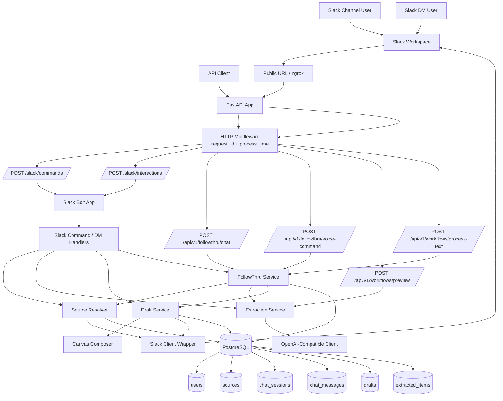
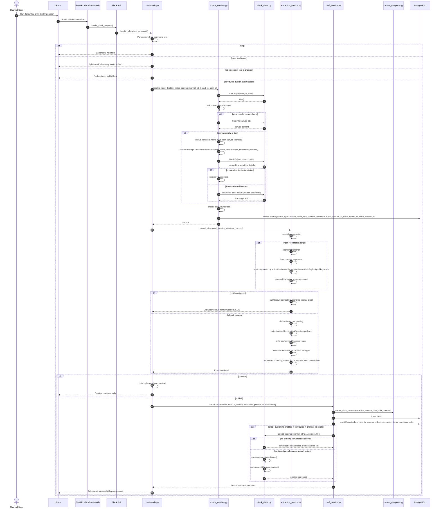
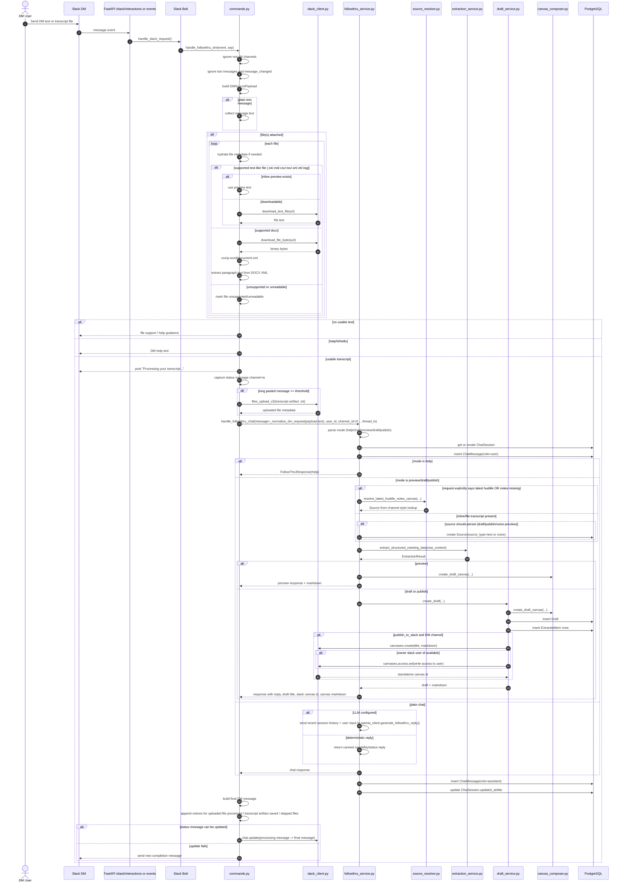
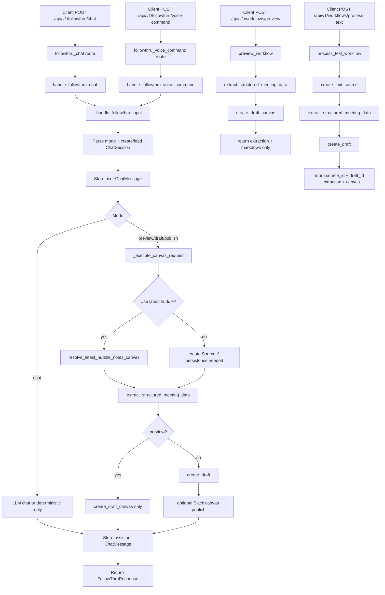
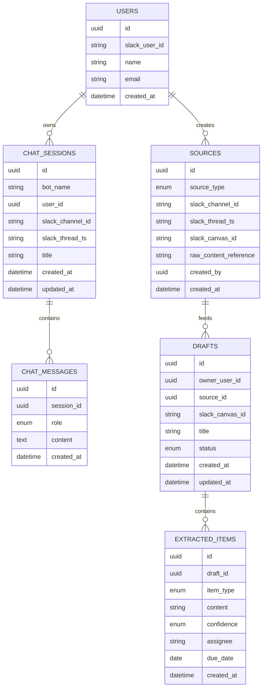

# FollowThru Architecture Diagrams

Generated on 24 Mar 2026 22:57.

This document contains the in-depth Mermaid source for the current FollowThru architecture and runtime flows.

## System HLD

High-level runtime architecture showing Slack, FastAPI, services, integrations, and persistence layers.

## Channel Flow

End-to-end slash-command flow for resolving huddle notes, transcript fallback, extraction, and channel canvas publication.

## DM Flow

Deep DM workflow including file ingestion, transcript artifact upload, session persistence, extraction, and standalone canvas publication.

## Direct API Flow

Non-Slack API routes for preview, process-text, chat, and voice-command.

## Persistence Model

Core relational persistence model for users, sources, sessions, drafts, and extracted items.

